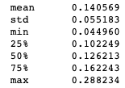
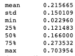
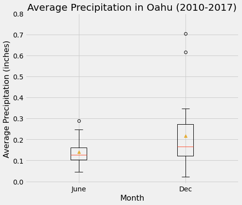
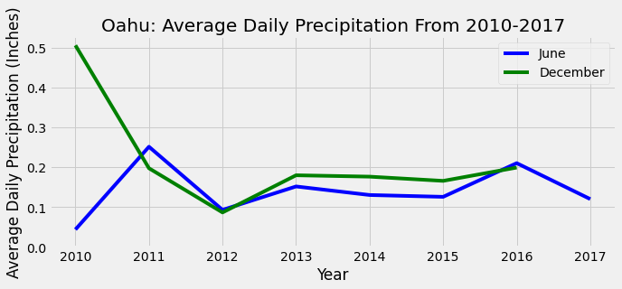
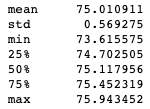
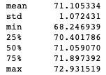
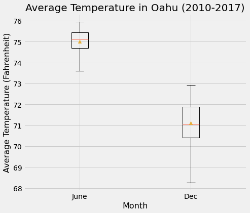
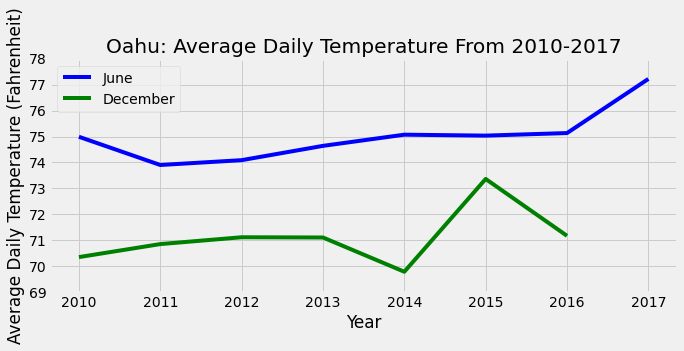

 # Surf's Up

# Project Overview
The context of this project is to assess whether a surf and ice cream shop would be a viable business venture in Oahu. This project specifically focuses on whether seasonal weather changes would be too disruptive to the business. To address this question, precipitation and temperature data in June and December from 2010 to 2017 was analysed. The data was collected from 9 weather stations in Oahu. 

# Resources
- Software: Python 3.8.2, Jupyter Notebook 6.0.3, pandas 1.0.3, numpy 1.18.1, matplotlib 3.1.3, sqlalchemy 1.3.17
- Data: <[hawaii.sqlite](data/hawaii.sqlite)>

# Results
## Precipitation
Precipitation data is shown in inches. 

- Statistics of average daily precipitation in June from 2010 to 2017, inclusive, are as follows (Table 1):
### Table 1

- On average, June has a count of 28.8 days of precipitation. 

- Statistics of average daily precipitation in December from 2010 to 2016, inclusive, are as follows (Table 2):
### Table 2

- On average, December has a count of 28.1 days of precipitation. 

- Figure 1 is a visual comparison of these statistics:
### Figure 1

- Median average precipitation (inches) is 0.13 and 0.17 for June and December, respectively.

- Figure 2 compares average daily precipitation over the years (2010-2016) between June and December:
### Figure 2

## Temperature
Temperature data is shown in Fahrenheit (F). 

- Statistics of average daily temperature in June from 2010 to 2017, inclusive, are as follows (Table 3):
### Table 3

- Statistics of average daily temperature in December from 2010 to 2016, inclusive, are as follows (Table 4):
### Table 4

- Figure 3 is a visual comparison of these statistics:
### Figure 3

- Median average temperature (F) is 75.1 and 71.1 for June and December, respectively.

- Figure 4 compares average daily temperature over the years (2010-2016) between June and December:
### Figure 4

# Discussion
## Precipitation
The average daily precipitation for both June and December was mild (mean of 0.14 and 0.22 inches, respectively). This was true for most days of the month (75% of days in June and December have 0.16 or less and 0.27 or less inches of rain, respectively). However, there was a small amount of precipitation on most days (average counts of 28.8 and 28.1 days of rain for June and December, respectively). This was further supported by a "non-zero" average minimum precipitation for both months (June: 0.04 inches, December: 0.02 inches).

There was overlap of data ranges in Figure 1, demonstrating that average daily precipitation was similar between the two months. Also, both months showed outliers representing sporadic days of unexpectedly increased, albeit mild (no more than ~0.7 inches), amounts of precipitation. December did have a slightly wider range and slightly higher amounts of precipitation. This was shown by standard deviations of 0.06 vs. 0.15, and min and max ranges of 0.04 to 0.29 inches vs. 0.02 to 0.7 inches for June and December, respectively. Finally, it was also demonstrated by the slight right skew of the mean (0.22 inches) compared to the median (0.17 inches) for December. 

Figure 2 showed that average daily precipitation was similar and mild (about 0.1 to 0.25 inches) for June and December for 6 years (2011-2016), with 2010 showing December with a higher amount than June (0.5 vs. 0.05 inches). 

## Temperature
June temperatures were consistently a few degrees (~4 degrees F) higher than December temperatures. This assertion is supported by the mean of 75.0 and 71.1 F for June and December, respectively, and by the non-overlapping data ranges in Figure 3. It was also true across the years (2010 to 2016) as shown in Figure 4. Nonetheless, both months showed mainly warm temperatures. Most days (75%) in June were between 74.7 to 75.9 F, and most days (75%) in December were between 70.4 to 72.9 F. 

December did show a wider range of temperatures as evidenced by the standard deviations (1.07 vs. 0.57 for December vs. June) and min. and max. values (68.2 min. to 72.9 max. F for December vs. 73.6 min. to 75.9 max. F for June). The wider range is visualized in Figure 3 as greater distance between upper and lower boundaries. No outliers (i.e. uncharacteristically cold or hot temperatures) were present in June and December temperature data. 

# Summary & Limitations
Based on precipitation and temperature data from June and December from 2010-2017, seasonal weather changes would not be expected to disrupt a surf and ice cream shop business. Although there was precipitation on most days, the amount was mild, and temperatures were generally warm. Limitations of the analysis were that December 2017 data was unavailable, that data was not always available from all 9 weather stations, and that only 2 months of each year were analysed for seasonal weather changes. It may be that June and December are not ideal months to represent drastic seasonal changes in weather. 

# Recommendations for Further Analysis
Recommendations include:

1) That more than 2 months are analysed for seasonal weather changes. Investigation of average daily precipitation over a year would show days of unexpectedly high amounts of precipitation. For example, 2016 had a day with 6.7 inches of precipitation. 

    Sudden bouts of high amounts of precipitation are related to hurricanes and flooding which has business implications for a surf and ice cream shop. These include whether the shop would be closed during certain times of the year, shop location, and costs related to shop repair. The dataset could be analysed to determine if there is a pattern of months that these days tend to occur on and for how many days (if hurricane season data is unavailable or insufficient), and correlation with weather station location could reveal ideal locations for a shop e.g. north- or southside of the island. 

2) That analysis is performed on additional weather parameters e.g. wind conditions (which greatly affects surfing), and number of days with sunshine or clear skies, which has an impact on ice cream sales and tourism in general. 

3) Histograms of precipitation or temperature could be created for select months to obtain more specific data. Examples include a histogram of the number of days of the month with a specific amount of precipitation or less, and number of days of the month with a specific temperature or warmer. This analysis could be informative if the shop will only be open during or only serving ice cream during ideal months of the year. 